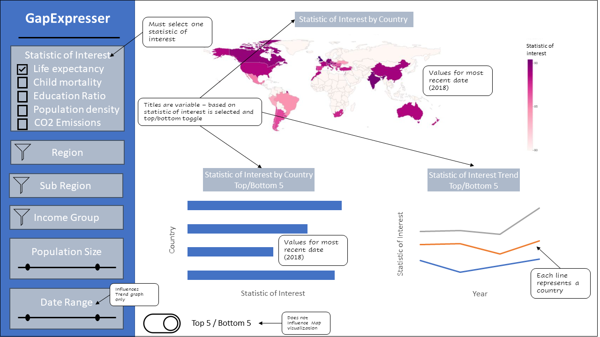

# Proposal

## Motivation and purpose

Our role: Data scientist consultancy firm

Target audience: Development aid agencies (Not-for-profits, charities, etc.) 

Development aid agencies are varied in size, missions, expertise, and experience. Some agencies operate with a very narrow scope, in location and/or directive, while others operate globally and in many development areas.  Large agencies often have the resources to hire dedicated research staff or employ experts in their chosen area of focus, but many agencies do not have these resources.   We propose building a data visualization app to assist these organizations visually explore some key statistics for different countries/regions.  This will help them identify countries/regions that would benefit from the type of service the agency provides, or gain additional insight into a region where they already operate.  These data visualizations may also challenge some misconceptions about a particular region, which in turn can help these agencies better serve the communities they operate in.   Our app will provide these organizations a snapshot of several key development statistics. Users can explore these statistics by filtering by region and other demographic factors.

## Description of the data

We will be visualizing country data from the summarized [Gapminder dataset](https://raw.githubusercontent.com/UofTCoders/workshops-dc-py/master/data/processed/world-data-gapminder.csv) which has 14 columns containing various demographic data for each country from the year 1800 to 2018, although data from the earlier years is often missing. The majority of our dashboard will focus on  the more current data but the timeseries data will be used to show the trends over time where appropriate. Each country has has an associated region and sub_region which will be used mostly as filters along with income group (low, medium or high) and population size. The health related indicators such as life_expectancy (years) and child_mortality (deaths of children under 5 per 1,000 live births) of countries will be showcased along with carbon dioxide emissions (tonnes per capita) and population density (people per square km). Furthermore, to show the divide in education levels between men and women, we will create a ratio using the years_in_school for women and divide this statistic with year_in_school for men, allowing us to track this new variable over time and between countries more easily.  

## Research questions you are exploring

Alice is a financial manager of “One World One Dream”, a non-profit charity cooperation designed to help alleviate education imbalanced issues among Least Developed Countries. Alice now received a $1,000,000 CAD charity fund from University of British Columbia for providing financial aid to young girls in West-Africa getting back to school. She now wants to be able to [**explore**] a dataset in order to [**compare**] each countries’ imbalanced opportunity for receiving pre-high school level education, so that she can [**decide**] how to distribute the fund received from UBC to maximize the impact from the fund. 

Alice then finds GapExpresser using which she could find the valuable insights from the data and make important decisions. This application can show the overview of history of the educational discrepancy between men and women in each year among different countries in West-Africa, allowing Alice to [**filter**] the data based on some criteria.

By exploring the data in hand and the relative information observed from academic journals or news, Alice may notice that the educational discrepancy between men and women experienced a great decline in countries that received funds from World Education Services. However, there are a number of countries that did receive the funds but didn’t have a significant improvement record in women education level. Therefore, to make the best decision, Alice decided, based on analysis using GapExpresser, to focus her research and funds on those relatively “fund-sensitive” countries. 

## App sketch

